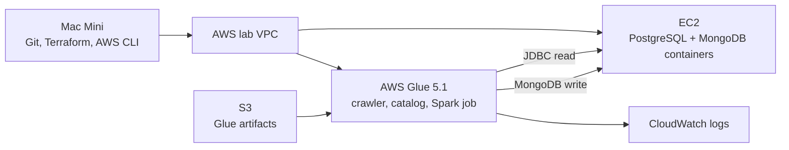

# AWS Glue PostgreSQL-to-MongoDB Lab

## Objective

Build a disposable learning lab that uses AWS Glue 5.1 to discover synthetic PostgreSQL order data, transform the relational rows with PySpark, write nested MongoDB documents, and reconcile the result. The complete lab is designed to be repeatable and destroyable from a clean Mac Mini.

## Architecture

One Region, VPC, subnet, Availability Zone, EC2 host, crawler, and Glue job keep the lab focused on the migration workflow.

## What this lab creates

When the later roadmap tasks are implemented and the lab is run, it creates:

- a dedicated VPC with one subnet, restricted security groups, and required VPC endpoints;
- one Systems Manager-managed EC2 instance hosting PostgreSQL and MongoDB containers;
- encrypted S3 storage, Secrets Manager secret containers, and lab-scoped IAM roles;
- PostgreSQL and MongoDB Glue connections, a crawler, Data Catalog tables, and one on-demand Glue 5.1 Spark job; and
- CloudWatch logs plus redacted reconciliation output.

It does not create a NAT Gateway, public database ingress, scheduled jobs, remote Terraform state, or CI deployment credentials.

## Time and cost

Plan approximately two to three hours for a first guided run. A short, promptly destroyed session is intended to cost only a few US dollars, but that is an estimate rather than a quote; current AWS prices, runtime, and retries determine the actual charge. Do not leave the lab running overnight.

> [!WARNING]
> **Destroy is mandatory.** Finish every lab session with the destroy runbook and `make destroy-lab` after that target is implemented. Stopping EC2 alone does not remove all billable resources.

## Primary sequence

1. Check the [prerequisites](docs/runbook/00-PREREQUISITES.md).
2. Deploy the [AWS infrastructure](docs/runbook/01-DEPLOY-INFRASTRUCTURE.md).
3. Create the disposable database secrets as directed by the infrastructure runbook.
4. Start and seed [PostgreSQL and MongoDB](docs/runbook/02-START-DATABASES.md) on EC2.
5. Deploy the Glue code using the [Glue configuration runbook](docs/runbook/03-CONFIGURE-GLUE.md).
6. Run the crawler and confirm the intended catalog tables with that same Glue runbook.
7. Run the [snapshot migration](docs/runbook/04-RUN-MIGRATION.md).
8. [Validate](docs/runbook/05-VALIDATE-AND-RERUN.md) source-to-target reconciliation.
9. Run the deterministic rerun test in the validation runbook.
10. [Destroy the lab](docs/runbook/06-DESTROY.md) and confirm cleanup.

The numbered runbooks contain the operational commands, expected results, verification, reset behavior, and troubleshooting. This page intentionally does not duplicate them.

## Prerequisites summary

You will need a personal AWS account, GitHub access, a Mac terminal, Git, AWS CLI v2, Terraform, GNU Make, and the local test runtimes identified by the prerequisites runbook. Use the personal AWS profile in `us-east-1`; stop if identity checks show a work account. Docker Desktop is optional for the later local-only data-layer path, not a core lab prerequisite.

## Runbooks

- [Runbook index](docs/runbook/README.md)
- [00 — Prerequisites](docs/runbook/00-PREREQUISITES.md)
- [01 — Deploy AWS infrastructure](docs/runbook/01-DEPLOY-INFRASTRUCTURE.md)
- [02 — Start and verify databases](docs/runbook/02-START-DATABASES.md)
- [03 — Configure and verify AWS Glue](docs/runbook/03-CONFIGURE-GLUE.md)
- [04 — Run the snapshot migration](docs/runbook/04-RUN-MIGRATION.md)
- [05 — Reconcile and test rerun behavior](docs/runbook/05-VALIDATE-AND-RERUN.md)
- [06 — Destroy the lab](docs/runbook/06-DESTROY.md)
- [07 — Troubleshooting](docs/runbook/07-TROUBLESHOOTING.md)

## Current status

`GLUE-000` and `GLUE-010` are complete in [PR #1](https://github.com/Korrojo/aws-glue-postgres-mongodb-lab/pull/1) and [PR #2](https://github.com/Korrojo/aws-glue-postgres-mongodb-lab/pull/2). `GLUE-020` — the disposable AWS foundation and EC2 workflow — is **IN PROGRESS**. Glue resources, transformation, reconciliation, and destruction automation belong to later roadmap tasks. See the [roadmap](docs/project/ROADMAP.md) for task ownership and status.
