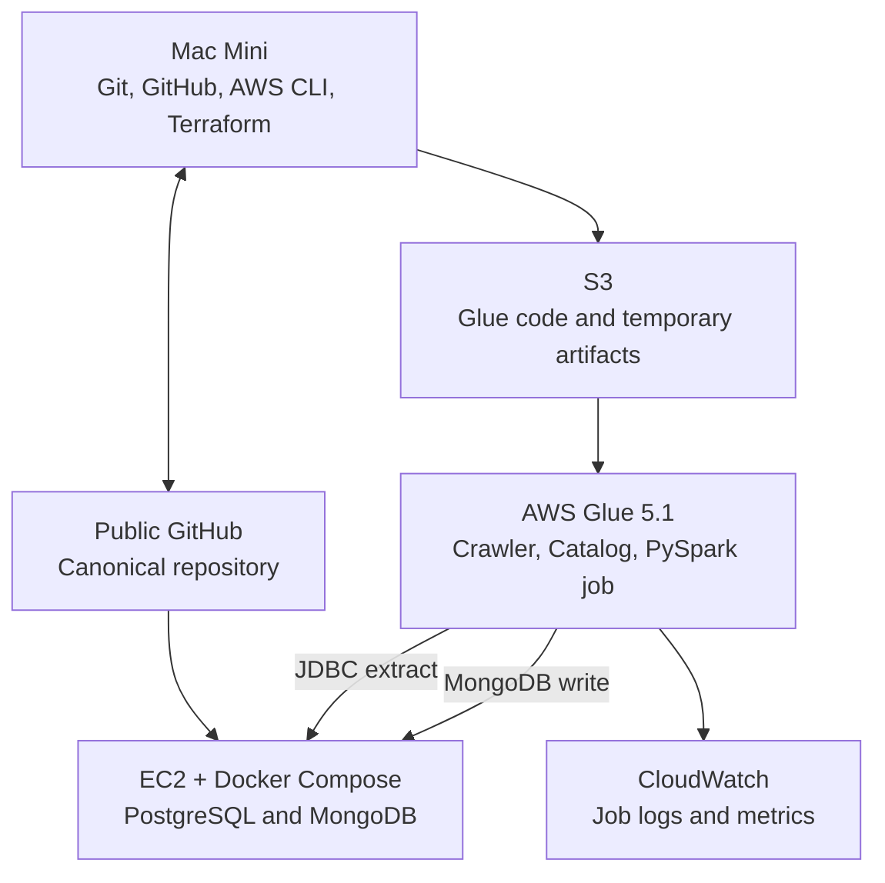

# AWS Glue PostgreSQL-to-MongoDB Lab Design

Status: **Authoritative**  
Version: **1.0 snapshot lab**  
Target repository: **public GitHub repository**  
Primary AWS Region: **us-east-1**

## 1. Objective

Build a disposable, repeatable lab that demonstrates an end-to-end relational-to-document migration with AWS Glue:

- PostgreSQL is the relational source.
- MongoDB is the document target.
- Both databases run as Docker containers on one EC2 instance.
- AWS Glue discovers the source schema, extracts relational rows, performs PySpark transformations, and writes nested MongoDB documents.
- Automated reconciliation proves that source and target represent the same business data.

The lab must be understandable, executable, and destroyable from a clean Mac Mini.

## 1.1 Lab simplicity principle

This is a learning lab, not a production platform. It must cover every component required for the Glue workflow without adding enterprise infrastructure that does not teach the workflow.

Keep:

- one repository;
- one AWS Region;
- one VPC, subnet, and Availability Zone;
- one EC2 instance;
- one PostgreSQL container;
- one MongoDB container;
- one crawler;
- one Glue job;
- one snapshot data flow;
- one clear deploy-to-destroy runbook sequence.

Do not add:

- multiple environments or accounts;
- reusable enterprise Terraform module layers;
- remote state, workspaces, or state-locking services;
- CI/CD deployment to AWS;
- custom AMIs or image-building pipelines;
- load balancers, autoscaling, Route 53, Kubernetes, or HA database topology;
- enterprise observability dashboards or alerting platforms;
- policy-as-code frameworks;
- secrets rotation infrastructure;
- production TLS/PKI construction;
- schedules or unattended execution.

Credential protection, restricted database ports, resource tagging, verification, and reliable teardown are required lab safety—not production-grade expansion.

## 2. Fixed decisions

| Decision | Version 1 choice |
|---|---|
| Development workstation | Personal Mac Mini |
| Source control | Public GitHub repository |
| AWS provisioning | Terraform invoked from Mac Mini |
| Region | `us-east-1` |
| Relational source | Containerized PostgreSQL |
| Document target | Containerized MongoDB Community Edition |
| Database host | One disposable Amazon Linux EC2 instance |
| EC2 administration | AWS Systems Manager; no inbound SSH |
| ETL service | AWS Glue for Spark 5.1 |
| Glue job language | Python/PySpark |
| Source metadata | Glue JDBC connection, crawler, and Data Catalog |
| Target connection | Native Glue MongoDB connection |
| Load type | Full snapshot with deterministic rerun behavior |
| Secrets | AWS Secrets Manager; values created outside Terraform state |
| Glue worker baseline | `G.1X`, two workers |
| Infrastructure networking | Dedicated VPC, one subnet, no NAT Gateway |
| CDC | Deferred to a separate future phase |

## 3. Scope

### Included

- Public-repository governance and secret scanning safeguards.
- Reusable Docker Compose configuration for PostgreSQL and MongoDB.
- Deterministic synthetic order and order-item fixtures.
- Dedicated disposable VPC and security groups.
- EC2 bootstrap through user data and Systems Manager.
- Public GitHub clone and pull on EC2.
- Optional EC2-to-GitHub push using a repository-scoped write-enabled deploy key.
- S3 storage for Glue scripts, packaged application code, and temporary data.
- Secrets Manager resources and a separate value-seeding command.
- Glue IAM role, JDBC connection, MongoDB connection, crawler, Data Catalog database, and Spark job.
- PySpark join, normalization, nesting, sorting, totals, and type conversion.
- Unit tests, infrastructure checks, reconciliation, rerun test, logging, cost check, and teardown.

### Excluded

- Oracle.
- CDC, logical replication slots, DMS, Debezium, Kafka, MSK, or Kinesis.
- AWS Glue streaming jobs.
- MongoDB Atlas or Amazon DocumentDB.
- MongoDB replica sets, sharding, Ops Manager, or backup configuration.
- TLS certificate construction for the two lab databases.
- Production sizing, load testing, autoscaling, or HA.
- GitHub Actions deployment to AWS.
- Remote Terraform backend.
- NAT Gateway.

## 4. System context



The EC2 clone contains Docker Compose, initialization files, and operational scripts. Glue executes code from S3, not from the EC2 filesystem.

## 5. AWS topology

### 5.1 Network

Create a dedicated VPC such as `10.40.0.0/16` with one subnet such as `10.40.10.0/24` in one Availability Zone.

The subnet has an internet-gateway route so the EC2 instance can pull public container images and clone the public GitHub repository. The EC2 instance may receive an ephemeral public IPv4 address, but its security group has no public inbound rules.

Glue elastic network interfaces run in the same subnet as the EC2 host. This satisfies the constraint that one Glue job run is associated with one subnet.

Create:

- an S3 gateway VPC endpoint;
- a Secrets Manager interface endpoint so Glue can retrieve connection credentials without a NAT Gateway;
- no NAT Gateway.

### 5.2 Security groups

`glue-sg`:

- self-referencing inbound All TCP for Glue driver/executor communication;
- outbound HTTPS and database access, or default outbound during the lab if Terraform documents it clearly.

`database-host-sg`:

- inbound TCP 5432 from `glue-sg` only;
- inbound TCP 27017 from `glue-sg` only;
- no inbound SSH;
- no inbound rule using `0.0.0.0/0` or `::/0`.

`endpoint-sg`:

- inbound TCP 443 from `glue-sg` and `database-host-sg`.

### 5.3 EC2

- Amazon Linux current supported generation.
- Initial size: `t3.medium`.
- Encrypted gp3 root volume sized only for the lab.
- Systems Manager instance profile.
- Lab-scoped permission to read the two database secrets and write only the public deploy-key value if that optional workflow is implemented.
- User data installs Git and Docker, enables Docker, and records bootstrap completion.
- Database startup occurs only after secret values exist.

The repository is cloned to `/opt/aws-glue-postgres-mongodb-lab`. The lab may clone and pull the reviewed `main` branch for simplicity. Each lab run records the Git commit SHA so results can be traced to the code that ran.

## 6. GitHub and EC2 workflow

The GitHub repository is public, so EC2 can clone it over HTTPS without credentials.

The default workflow remains:

```text
Mac Mini -> feature branch -> GitHub PR -> reviewed main -> EC2 clone/pull
```

EC2 push is optional but supported:

1. Generate an Ed25519 key pair on EC2 through an SSM command.
2. Display only the public key.
3. Add it manually to the GitHub repository as a write-enabled deploy key.
4. Change the EC2 remote to the SSH form.
5. Push only feature branches; never push directly to `main`.

The private key remains on the disposable EC2 instance, is never returned in command output, and is never committed. Terraform must not manage the GitHub deploy key because that would require broader GitHub credentials in this first lab.

## 7. Secrets flow

Terraform creates secret containers but not secret values:

- `/aws-glue-postgres-mongodb-lab/postgres`
- `/aws-glue-postgres-mongodb-lab/mongodb`

A Mac-side script generates passwords locally and calls `aws secretsmanager put-secret-value` without printing the values. Secret values must not be Terraform variables, Terraform outputs, Make arguments, GitHub secrets, or repository files.

After secret creation, an SSM command retrieves the values on EC2 and starts Docker Compose. Temporary environment files, if unavoidable, must have mode `0600` and be deleted immediately after use. Commands and logs must not echo credentials.

## 8. Source data model

Schema: `sales`

### `sales.orders`

| Column | Type | Rules |
|---|---|---|
| `order_id` | `BIGINT` | Primary key |
| `customer_id` | `BIGINT` | Required |
| `customer_first_name` | `TEXT` | Required |
| `customer_last_name` | `TEXT` | Required |
| `customer_email` | `TEXT` | Required; fixture includes mixed case/whitespace |
| `order_status` | `TEXT` | Required; fixture includes normalization cases |
| `ordered_at` | `TIMESTAMPTZ` | Required |
| `updated_at` | `TIMESTAMPTZ` | Required; retained for future incremental design |
| `is_deleted` | `BOOLEAN` | Required; default false; retained for future CDC design |

### `sales.order_items`

| Column | Type | Rules |
|---|---|---|
| `order_item_id` | `BIGINT` | Primary key |
| `order_id` | `BIGINT` | Foreign key to `orders.order_id` |
| `line_number` | `INTEGER` | Unique within order |
| `sku` | `TEXT` | Required |
| `quantity` | `INTEGER` | Must be greater than zero |
| `unit_price` | `NUMERIC(12,2)` | Must be nonnegative |
| `updated_at` | `TIMESTAMPTZ` | Required |
| `is_deleted` | `BOOLEAN` | Required; default false |

Seed data must be deterministic and synthetic. Include enough records to test:

- multiple items per order;
- one item per order;
- item ordering by `line_number`;
- email and status normalization;
- decimal totals;
- timestamps in different offsets that normalize to UTC;
- soft-deleted records excluded from the snapshot;
- invalid fixtures isolated for failure-path tests.

## 9. Target document model

Database: `migration_lab`  
Collection: `orders`

```json
{
  "_id": 1001,
  "customer": {
    "id": 42,
    "name": "Ava Smith",
    "email": "ava@example.com"
  },
  "orderedAt": "2026-08-01T14:30:00Z",
  "updatedAt": "2026-08-01T15:10:00Z",
  "status": "SHIPPED",
  "items": [
    {
      "id": 5001,
      "lineNumber": 1,
      "sku": "KB-101",
      "quantity": 2,
      "unitPrice": 25.00,
      "lineTotal": 50.00
    }
  ],
  "orderTotal": 50.00,
  "migration": {
    "source": "postgresql",
    "mode": "snapshot"
  }
}
```

### Mapping rules

- `orders.order_id` becomes deterministic MongoDB `_id`.
- Customer fields become the nested `customer` object.
- Email is trimmed and lowercased.
- Customer name is trimmed and composed from first and last name.
- Status is trimmed and uppercased.
- Timestamps are normalized to UTC.
- Non-deleted items are embedded under `items` and sorted by `lineNumber` ascending.
- `lineTotal = quantity * unitPrice`.
- `orderTotal = sum(items.lineTotal)`.
- Relational `order_id` is not repeated inside each embedded item.
- Soft-deleted orders and items are omitted from the snapshot.
- Decimal arithmetic must not pass through floating-point calculations.

## 10. Glue workflow

1. A PostgreSQL Glue connection references the JDBC URL, VPC, subnet, security group, and Secrets Manager credential.
2. A crawler catalogs only `sales.orders` and `sales.order_items`.
3. The Glue job reads both catalog tables as DynamicFrames or DataFrames.
4. Source validation fails the job for invalid primary keys, duplicate business keys, orphan items, invalid quantity, or invalid unit price.
5. Transformation code uses standard Spark DataFrame operations.
6. Reusable transformations live under `src/glue_lab/`; the Glue entry script lives under `glue/jobs/`.
7. The transformed DataFrame is converted to a DynamicFrame only at the Glue connector boundary if required.
8. The native MongoDB sink writes the `migration_lab.orders` collection using the named Glue connection.
9. `replaceDocument=true` and deterministic `_id` values are used for rerun behavior.
10. The second run must prove that target count does not increase and documents are replaced or updated as designed.

If the actual Glue connector behavior contradicts the documented rerun expectation, record the observed evidence and request a design decision. Do not silently add a third-party connector or destructive pre-load operation.

## 11. Observability

Enable continuous Glue logging. Log only:

- Glue job run ID;
- source table counts;
- valid and rejected counts;
- transformed document count;
- target collection name;
- duration by phase;
- reconciliation outcome.

Never log connection strings with credentials, secret values, environment contents, or full source/target records.

## 12. Validation

Required reconciliation:

- active source order count equals target document count;
- active source item count equals the sum of embedded array sizes;
- every active order key exists in MongoDB;
- every MongoDB document corresponds to one active source order;
- per-order item count matches;
- per-order total matches exact decimal source calculation;
- item order is ascending by `lineNumber`;
- normalization rules match expected fixtures;
- no soft-deleted order or item appears;
- second Glue run leaves target count unchanged.

The validation command exits nonzero on any mismatch and writes a redacted summary artifact.

## 13. Cost and lifecycle

Cost controls:

- one small EC2 instance active only during a lab session;
- two `G.1X` Glue workers;
- short, manually triggered crawler and job runs;
- no NAT Gateway;
- one subnet and one Availability Zone;
- no unattended schedules;
- lifecycle rules for temporary S3 objects and logs where appropriate;
- `make destroy-lab` as the mandatory final step.

All resources use a stable project tag. Post-destroy validation must list remaining project-tagged resources and fail if a known billable resource remains.

## 14. CDC future phase

CDC is not part of version 1. Glue JDBC bookmarks are not a substitute for CDC because they can track new sequential rows but do not reliably capture updates to existing rows or deletes.

A future lab may evaluate:

```text
PostgreSQL logical WAL
  -> AWS DMS
  -> Kinesis Data Streams or S3 change files
  -> Glue streaming or micro-batch transformation
  -> MongoDB
```

That phase must separately design:

- logical replication and slot lifecycle;
- insert/update/delete event semantics;
- ordering and duplicate delivery;
- checkpoint recovery;
- reconstruction of an order document when one child item changes;
- tombstones and deletes;
- target idempotency;
- DMS intermediary cost and cleanup.

Version 1 retains `updated_at`, `is_deleted`, and deterministic IDs only to keep the data model CDC-ready. It must not enable replication slots.

## 15. Repository blueprint

```text
aws-glue-postgres-mongodb-lab/
├── .github/
│   ├── workflows/ci.yml
│   └── pull_request_template.md
├── AGENTS.md
├── LICENSE
├── Makefile
├── README.md
├── docker/
│   ├── compose.yaml
│   ├── mongodb/init/
│   └── postgres/init/
├── docs/
│   ├── project/
│   │   ├── ACCEPTANCE_CRITERIA.md
│   │   ├── COLLABORATION.md
│   │   ├── DOCUMENTATION_STANDARD.md
│   │   ├── DESIGN.md
│   │   └── ROADMAP.md
│   └── runbook/
│       ├── README.md
│       ├── 00-PREREQUISITES.md
│       ├── 01-DEPLOY-INFRASTRUCTURE.md
│       ├── 02-START-DATABASES.md
│       ├── 03-CONFIGURE-GLUE.md
│       ├── 04-RUN-MIGRATION.md
│       ├── 05-VALIDATE-AND-RERUN.md
│       ├── 06-DESTROY.md
│       └── 07-TROUBLESHOOTING.md
├── glue/
│   └── jobs/postgres_orders_to_mongodb.py
├── infrastructure/
│   └── terraform/
├── scripts/
│   ├── bootstrap-ec2.sh
│   ├── configure-ec2-github-write.sh
│   ├── deploy-glue-code.sh
│   ├── put-lab-secrets.sh
│   └── verify-destroyed.sh
├── src/
│   └── glue_lab/
│       ├── transformations.py
│       └── validation.py
├── tests/
│   ├── integration/
│   └── unit/
└── validation/
    └── reconcile.py
```

## 16. Authoritative references

- AWS Glue JDBC connections: https://docs.aws.amazon.com/glue/latest/dg/aws-glue-programming-etl-connect-jdbc-home.html
- AWS Glue MongoDB connections: https://docs.aws.amazon.com/glue/latest/dg/aws-glue-programming-etl-connect-mongodb-home.html
- AWS Glue versions: https://docs.aws.amazon.com/glue/latest/dg/release-notes.html
- AWS Glue VPC JDBC setup: https://docs.aws.amazon.com/glue/latest/dg/setup-vpc-for-glue-access.html
- AWS Glue job bookmarks: https://docs.aws.amazon.com/glue/latest/dg/monitor-continuations.html
- AWS Glue bookmark limitations: https://docs.aws.amazon.com/glue/latest/dg/glue-troubleshooting-errors.html
- PostgreSQL CDC with AWS DMS: https://docs.aws.amazon.com/dms/latest/userguide/CHAP_Source.PostgreSQL.html
- AWS DMS supported targets: https://docs.aws.amazon.com/dms/latest/userguide/CHAP_Introduction.Targets.html
- GitHub deploy keys: https://docs.github.com/authentication/connecting-to-github-with-ssh/managing-deploy-keys
